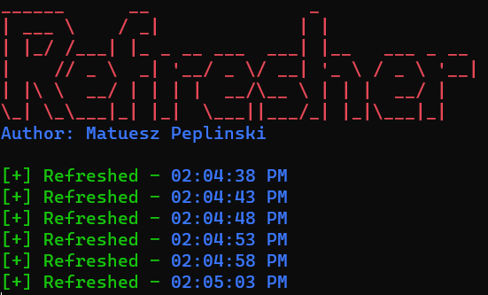
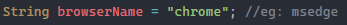

# Refresher
Author: Mateusz Peplinski
  
Tool:Auto Webpage Refresher 
 
 
  
Screenshot when Thread.Sleep() was set to 5seconsds (Above) 
### Editing The Source Code:
Change browser name by editing the browserName Variable. 
This will work globaly within the whole program
 
 
