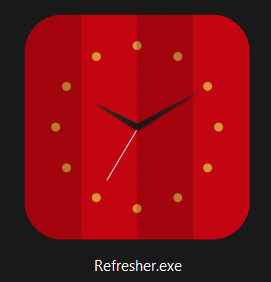

# Refresher
Author: Mateusz Peplinski
  
Tool:Auto Webpage Refresher 
 
 
  
Screenshot when 'Thread.Sleep()' was set to 5 seconsds (Above) 
### Editing The Source Code:
Change browser name by editing the 'browserName' Variable. 
This will work globaly within the whole program 
 
 
Change the refresh time by editing 'Thread.Sleep(XXX)'. 
Note: Time is in milliseconds 
 

### The Executable:
The executable can be found here on github in:  
``
/Refresher/bin/Debug/Refresher.exe
`` 
``
/Refresher/bin/Debug/Refresher.exe.config
`` 
``
/Refresher/bin/Debug/Refresher.pdb
``
 
 
 
